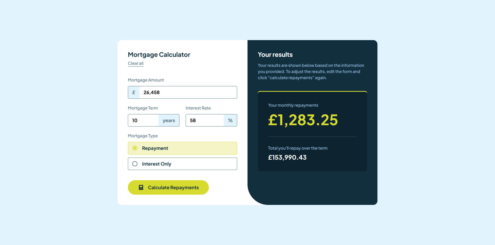

# Frontend Mentor - Mortgage repayment calculator solution

This is a solution to the [Mortgage repayment calculator challenge on Frontend Mentor](https://www.frontendmentor.io/challenges/mortgage-repayment-calculator-Galx1LXK73). Frontend Mentor challenges help you improve your coding skills by building realistic projects.

## Table of contents

- [Overview](#overview)
  - [The challenge](#the-challenge)
  - [Screenshot](#screenshot)
  - [Links](#links)
- [My process](#my-process)
  - [Built with](#built-with)
  - [What I learned](#what-i-learned)
  - [Continued development](#continued-development)
  - [Useful resources](#useful-resources)
  - [AI Collaboration](#ai-collaboration)
- [Author](#author)

## Overview

### The challenge

Users should be able to:

- Input mortgage information and see monthly repayment and total repayment amounts after submitting the form
- See form validation messages if any field is incomplete
- Complete the form only using their keyboard
- View the optimal layout for the interface depending on their device's screen size
- See hover and focus states for all interactive elements on the page

### Screenshot



### Links

- Solution URL: [GitHub](https://github.com/ruslan898/frontend-mentor_mortgage-repayment-calculator)
- Live Site URL: [GitHub Pages](https://ruslan898.github.io/frontend-mentor_mortgage-repayment-calculator/)

## My process

### Built with

- Semantic HTML5 markup
- SASS variables
- Flexbox
- CSS Grid
- Mobile-first workflow
- [React](https://reactjs.org/) - JS library

### What I learned

While working on this project, I learned how to implement basic custom form validation in React

```js
// Validation state values
const [values, setValues] = useState({
  amount: '',
  term: '',
  rate: '',
  type: '',
});
const [errors, setErrors] = useState({});

// Validation function
function validate() {
  const { amount, term, rate, type } = values;
  const newErrors = {};

  if (!amount) {
    newErrors.amount = 'This field is required';
  } else if (+amount <= 0 || +amount > 100_000_000) {
    newErrors.amount = 'Invalid value';
  }

  if (!term) {
    newErrors.term = 'This field is required';
  } else if (+term <= 0 || +term > 40) {
    newErrors.term = 'Invalid value';
  }

  if (!rate) {
    newErrors.rate = 'This field is required';
  } else if (+rate < 0 || +rate > 100) {
    newErrors.rate = 'Invalid value';
  }

  if (!type) {
    newErrors.type = 'This field is required';
  }

  return newErrors;
}
```

### Useful resources

- [react-number-format
  ](https://www.npmjs.com/package/react-number-format) - This npm package helped me with correct formatting and displaying input values

### AI Collaboration

I've used ChatGPT to correctly style some elements and configure react-number-format package to suit the project requirements

## Author

- GitHub - [ruslan898](https://github.com/ruslan898)
- Frontend Mentor - [@ruslan898](https://www.frontendmentor.io/profile/ruslan898)
